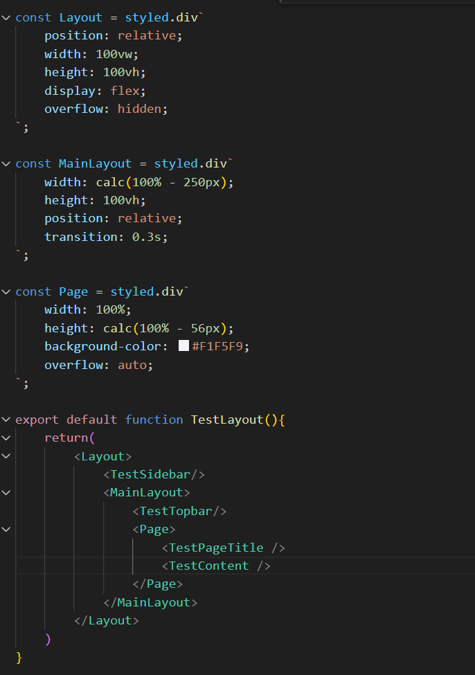
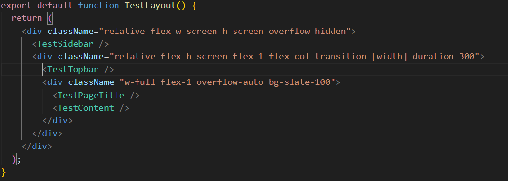

✅react ts -> tailwind설치
1️⃣ npm create vite@latest ( vite-project -> React -> ts)
2️⃣ cd vite-project에서 npm install
3️⃣ 다음 npm install tailwindcss @tailwindcss/vite
4️⃣ vite.config.ts에서 아래 추가
    import { defineConfig } from 'vite'
    import react from '@vitejs/plugin-react'
    import tailwindcss from '@tailwindcss/vite'
    // https://vite.dev/config/
    export default defineConfig({
      plugins: [
        react(),
        tailwindcss()
      ],
    })
4️⃣ tailwind.config.ts에서 아래 추가
  /** @type {import('tailwindcss').Config} */
  export const content = ["./index.html", "./src/**/*.{js,ts,jsx,tsx}"];
  export const theme = {
      extend: {},
  };
  export const plugins = [];
5️⃣ app.css 상단에 @import "tailwindcss"; 추가

이 라이브러리 어디서 쓰실 예정인지? (플랫폼에서만?)
-> kit(inspection, safety)에 emotion호환되는지 확인해보셨는지?
-> si 프로젝트들 c#으로 쓰는거 많은데 그부분은 어떻게 되는지?

[검토 해야할 것]

1. atomic 하지 않은 컴포넌트를 만들 때 emotion? css/scss/module? tailwind?
    1-1. 각 라이브러리에 커스텀 잘 되는지 확인하기 (12/5)
      => emotino이 가장 스타일링 코드가 짧음, emotion 사용 예정

2. 페이지에 어떤 스타일 라이브러리 쓸 지 검토하기
    2-1.  tailwind 효율적인지 데모 페이지 만들어서 확인하기
      
      => emotion 사용 시
      
      - 레이아웃까지 Emotion으로 작성하면 styled 컴포넌트가 불필요하게 많아지고, 구조 파악이 어려워지며, 런타임 스타일 생성 범위가 넓어져 비효율적

      => tailwind 사용 시
      
      - 레이아웃과 간격 정보를 구조 안에서 바로 확인할 수 있고, 유틸리티 클래스만으로 빠르게 구조를 잡을 수 있으며 정적 CSS라 성능 부담이 적음

    2-2. 만약 그렇다면, 컴포넌트에는 emotion(css-in-js),  페이지 tailwind(utility) 써야 하는 이유 정리하기
      => 컴포넌트: emotion | 재사용성 높고 캡슐화 하기 좋음, props, state 값을 이용해 스타일 동적 사용 가능
      => 페이지: tailwind | 페이지별로 레이아웃이 같으면 emotion이 편리하지만 지금은 레이아웃은 페이지별로 다름, flex와 간격 정도는 짧고 빠르게 작성 가능한 tailwind가 편리
      => 구조 tailwind, UI emotion으로 분리하면 유지보수 편리함 / 역할이 명확하고 문제 발생 시 수정 포인트 명확해짐

    2-3. 어떻게 스타일을 병행할 건지 정리하기(theme, 변수 등)

    2-4. 정리한 이유 중 기술적 이슈(ssr, 성능 비용 등)가 맞는지 개발팀과 크로스체크 하기
      => tailwind : 정적 빌드, 런타임 비용 증가시키지 x, 불필요한 css가 번들에 남지 않아 가벼움, 렌더링 비용 낮음, 스타일 재계산 구간 최소화
      => emotion : 필요한 곳만 런타임 스타일 생성함, UI컴포넌트에만 사용시 성능 오버헤드 최소화, ssr시 스타일 플래시 방지, 안정성 높음

    2-5. 디자인팀과 어떻게 협업 하면 좋을 지 의논하기